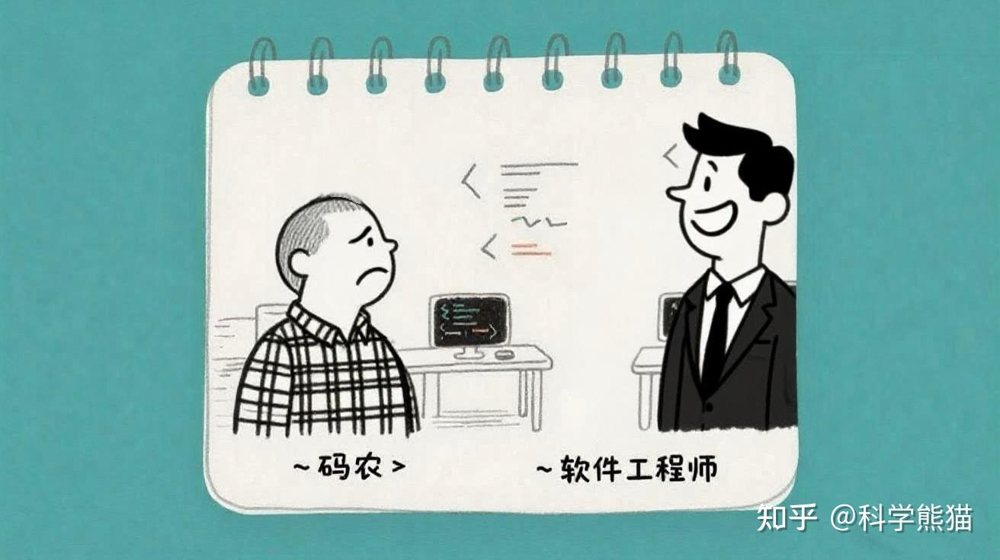

分享一个真实的小故事

很多年前，我刚成为一名腾讯的工程师的时。

<!--more-->

第一次了解到开发软件时，需要的关键角色配合。包括 程序员、产品经理、测试 以及 美工 等。

每当需要设计稿的时候，领导就会在工作群里说“你们找美工 xxx，出一下切图”。

那时候团队小，整个部门就 2、3 个美工，我们也一直称呼他们为切图的美工。

突然有一天，大约是在 06到 07 年之间的某个时间，全公司的“美工”通过公司内部网络，联合了起来。拒绝再被称呼为“美工”，必须称“设计师”，如果还有人喊“美工”，他们将拒绝提供设计稿！

然后，短短不到一周时间，“美工”的称呼，就在腾讯历史上消失，翻身运动大获成功！

小团体的坚决态度，竟迅速改变了全公司几千人，如雷霆般有力。事过多年，我仍记忆犹新。

且最神奇的事，虽然人还是那些人，但是，部门的“设计师”们，却从此显得更有价值，且看起来就带有很强的专业气质。

别人如何看待你，取决于你如何看待自己。

程序员们自称码农，以为是自己拥有谦虚精神的自嘲，但是却在潜意识中影响自己的价值观与行为。

太多的程序员没有“软件工程师”的觉悟和定位，在工作中找不到写代码的意义，慢慢忘记去思考“工程”何以为“工程”的价值与意义，忘记了架构师的专业高度是什么。本来很有创造力的，高度复杂的工作，也变成了索然无味的“完成任务”。

公众号：序员先生
