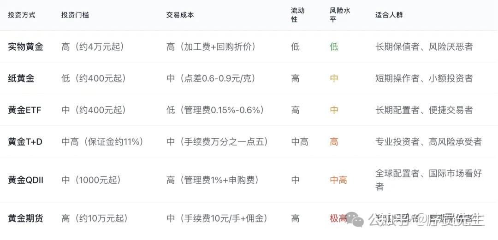
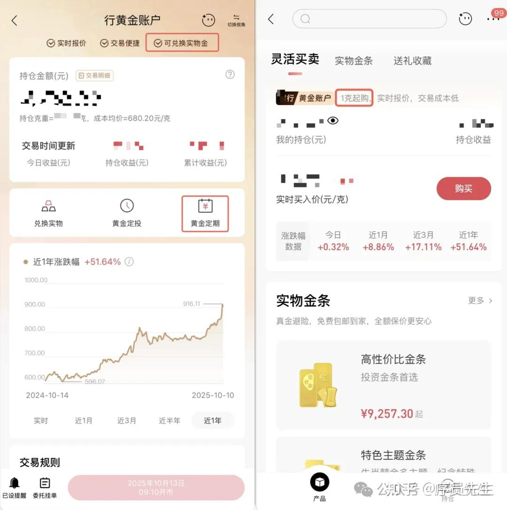
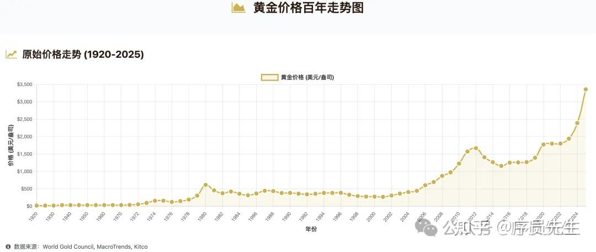
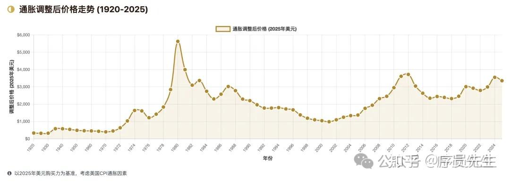
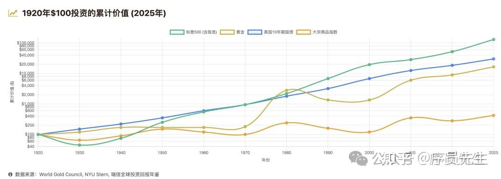
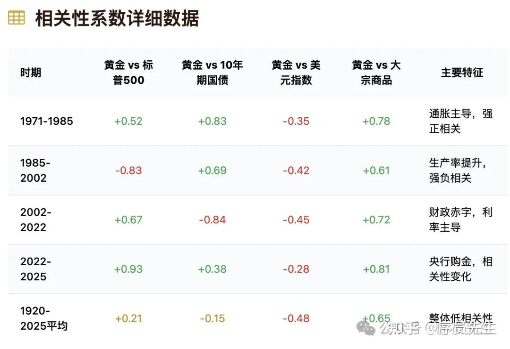
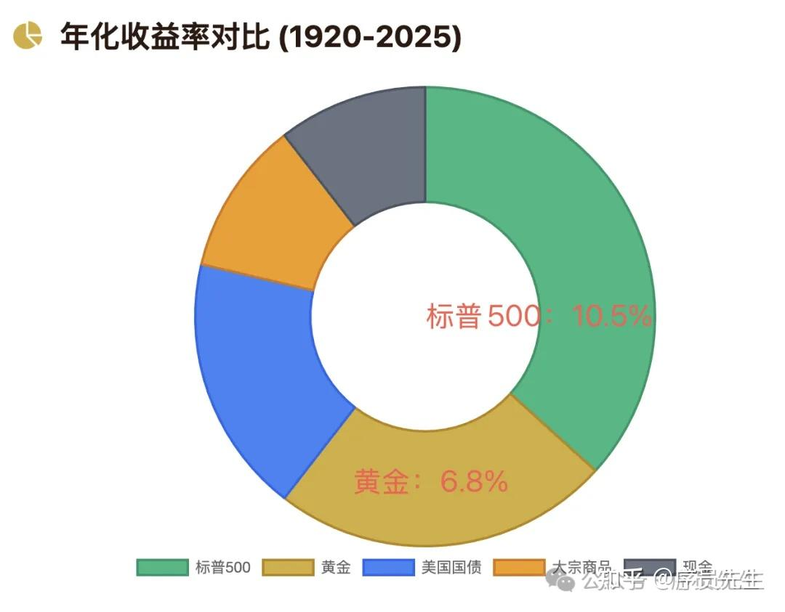
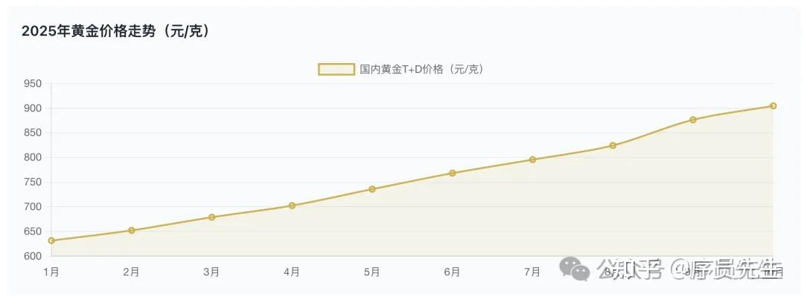
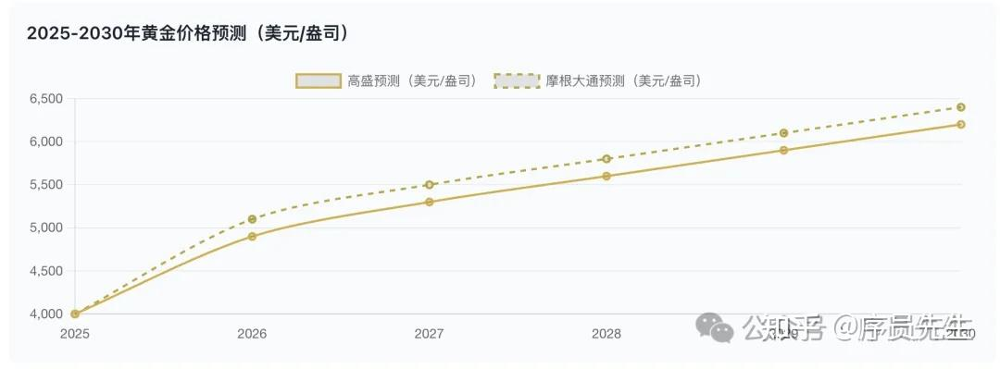

一般大家想要了解黄金投资方法时，会通过网络搜索或者AI问答。

得到看似丰富的信息，但由于“天下文章一大抄”的毛病，雷同的非常多。大概率都能得到下图总结出来的这些答案。

<!--more-->

但实际上，这些答案相对片面且稍有些过时。

真正最适合大家的方式往往很难检索到。

除了黄金ETF因为购买灵活，成本较低，是最常被大家推荐，也比较正确的选择之外，本文补充两个很多人没了解到的关键信息：

**第一个：关于“纸黄金”的信息纠正：**

网络上对纸黄金的投资建议中一般会提到两条：

“无法兑换实物黄金” 和 “按时间抽取管理费”。

因为这两条的原因，纸黄金往往在各类专业文章或博主视频中被建议度并不太高。

但实际上，纸黄金的投资形式，并没有被严格规定必须满足这2个条件。各大银行近些年来做了不同方式的优化改良。

例如上图：

某商银行的“黄金账户”产品，可以通过手机App直接购买，不但没有管理费，而且明确具备兑换实物黄金的能力。具有以下优势：

1、支持手机App一键兑换实物黄金，直接快递到家。

2、最低投资额度1克起，资金要求很低

3、无持有管理费（但在黄金的买入和卖出时有一次性的手续费收取。综合折算下来，如果购买后长年放置，综合持有成本会明显低于黄金ETF等基金类产品）。

4、长期持有可将黄金财产转为“黄金定期”，除了黄金本身价格增值以外，还有额外的定期利息 以 按比例的黄金克数发放。

在2003年中国银行首次推出纸黄金以来，多家国有银行和民营银行都陆续推出了类似上面的改良产品，包括“某商银行的 黄金账户 ”、"积存金"、“龙鼎金积存”、“添利金积存” 等等，规则各有差异，收费模式也各不相同。但基本都比传统纸黄金的投资价值要高。

长期持有的情况下，反而对于没有时间长期研究黄金的普通投资人来说，是比ETF等基金产品更值得选择的方式。

而各路财经博主往往还是按最传统的纸黄金规则在做介绍，比较过时且误导。

**第二个：专业投资圈 普遍采用的黄金仓位管理法**

因为黄金属于价格波动较大的投资类资产，且不具备天然的生息能力。其投资属性方面，不同人理解差异很大。

例如很多专业机构都非常重视黄金的投资价值，包括著名的全天候策略等基本都会考虑配置黄金。而巴菲特等部分专业人士又坚决不投资黄金。不同专家站在自己的思考维度上，都有自己的道理。

目前了解到基金经理圈子，投资黄金比较普遍的一个做法是**固定小仓位法**。

就是让黄金价值占自己全部投资仓位的10~15%范围。可以是10，也可以是15，自己给一个固定标准后，就长期持续执行。

以15%固定仓位标准举例，具体操作方法：

1、当黄金价格上涨速度超过其他资产，导致15%的仓位黄金涨幅达到或接近一定比例，例如自己规定上限是25%仓位。就需及时卖出部分黄金，恢复15%占比。

2、当黄金价格涨幅不及其他资产，或出现下跌。导致黄金仓位占比低于10%，则逢低买入，增加黄金投资到15%仓位。

这样操作的背后原理：

1、黄金在历史上出现过持续10年以上的持续上涨，也出现过持续20年的持续下跌&横盘。也有上涨下跌频繁切换的混乱时期，有涨跌难以预测的特性。

2、黄金在100多年的投资历史来看，大趋势是持续价值上涨的，因此适宜数十年的超长期持有。

3、黄金和股票、债券等其他大类资产的涨跌在历史上较多时间段都出现过涨跌互补现象。比较适宜作为风险避难，调整整体仓位的压舱石。

结合这几点，黄金涨跌对普通人来说难预测，又适宜在其他资产大跌时压舱或填补损失。因此调仓法在几十年的周期内，被大部分人证明了其长线上具备较强的实用性、稳定性和持有的体感友好性。

当然，如果只是2,3年周期内的操作，因为时间不够，可能较难感受到具体优势。需要长期固定仓位持有，最起码也在5年以上。

**最后：为方便理解上述方法，补充说明下黄金的波动和风险性：**

下图是最近100年来黄金的价格变动趋势，可以看到历史上横盘或下跌的年份是会持续出现多年，但整体大趋势是上涨。

不过，上图数据有比较大的缺陷，是没有考虑计价黄金的美元本身有长期通货膨胀因素，减除通胀因素后，可以得到下图的黄金实际价值变动曲线。可以看到，黄金并不能保障，你一定能赚钱。投资需谨慎！

黄金和其他投资类产品价格涨跌互补的历史数据：

**今年以来黄金价格变化和未来预测：**

最近两年，尤其今年。因为美元信用逐步崩塌，新的国家信用等价物没有建立起来之前。人类几千年来统一认知的价值等价物黄金，被各国央行，尤其是我国等大国，大量囤积。导致涨势喜人，下图是今年以来的上涨趋势。

因为美元信用的持续不稳定，目前国际投行的相关预测是倾向于认为，上行行情尚未结束，如下图，给出的价格预测是比较乐观的。

当然，从历史上来看，这类国际投行预测错误的概率是非常大的，只是作为信息了解，不作为投资建议。

信奉 “最贵的知识都是免费的”

致力于终身学习并分享，欢迎关注～
