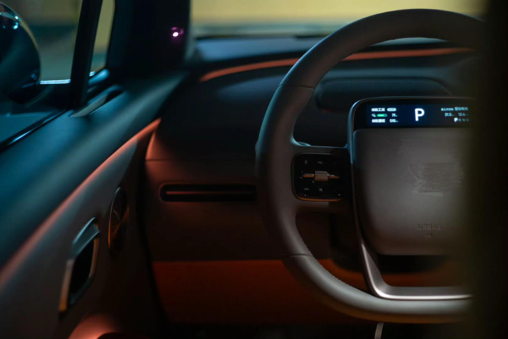
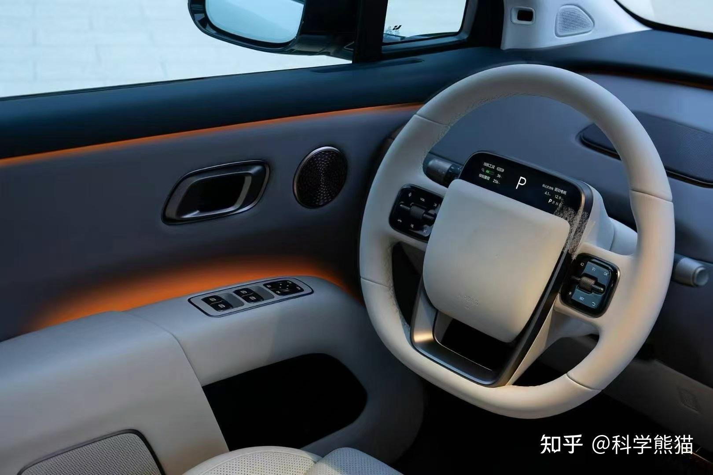

“浅色内饰好看，不过我怕脏，所以还是买了黑色内饰”

作为资深车迷，我的车友群很多。上面这句话，来自我认识的很多车友，在选择内饰颜色过程中的相同描述。这是一个事实。

<!--more-->

再分享另外一个事实：因为长期出差的关系，我每年打网约车的次数有数百次。

打车过程中的长期统计来看，深色内饰的新能源网约车，上车就遭遇浓郁臭味的比例超过 30%，轻微臭味也算的话，则能达到 70% 以上。而浅色内饰的新能源网约车，则极少能遇到臭味显著的情况。

油车会相对好不少，因为发动机的震动 通过 变速箱与传动轴向整车的传递，产生无时无刻不在的细微震动，这让油车司机的暴躁程度在无意间提升了很多倍，也因此，他们大概率喜欢开窗透气，舒缓身体感受。

而电车良好的静音，带来的开窗前后显著的舒适性下降，让这些新能源车司机选择长时间闭窗吹空调。

深色内饰，会因为看不见哪里脏了，而不知道需要擦拭哪里。

导致 人们身上的油渍，汗渍，食物残渣，泥尘 等等 长期沉积，并在封闭不开窗的环境下进行发酵变臭。

其实，除了网约车，很多家用新能源车也是一样的情况。只是亲戚朋友乘坐的时候出于礼貌，大概率是不会告知车主的。

这和人们因为爱干净而选择深颜色的初衷刚好相反。

“反直觉”在我们的生活中无处不在。

我的一个朋友，性格是超越常人的极度谨慎，因为担心交通事故，选择不买车，只打车以确保安全。但是，这明显不符合逻辑。一个极度小心重视安全的人，自己开车难道不是最安全的吗？坐其他不知来历司机开的车，才是把自己置于危险之中。

包括股市中的追涨杀跌，人人都想避免，然而事实是大部分人都未能避免。

“反直觉”的本质是我们潜意识的错误判断战胜表层逻辑思考的过程，潜意识的力量比我们以为的要强大的多。
