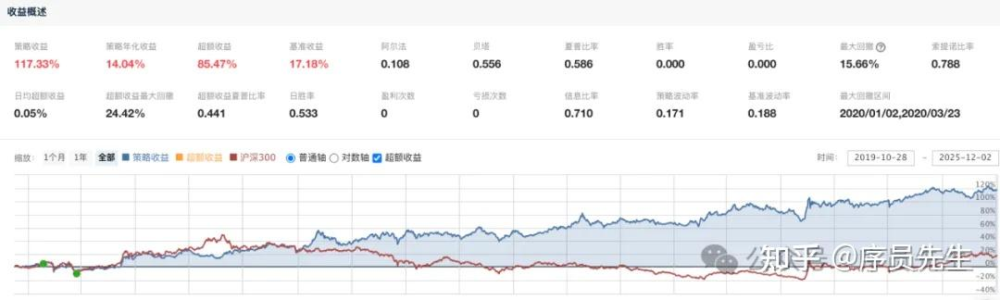

**先看看红底低波指数的收益率表现**

下图是一只跟踪 中证红利低波指数 的 ETF 产品，我回测了从 2019 年到目前6年时间的收益表现。

<!--more-->

红色曲线代表的对标产品是沪深 300ETF。回测6年是因为这只 ETF 产品成立至今一共6年。

**红利低波产品 6年 收益率合计是 117.33%，年化收益 14.04%。**

对于普通投资者来说，这个收益是是非常不错的。

而且曲线持续健康向上，呈现了长牛的特点。

而作为对比的A股代表性的沪深300，年化就非常的低了。其中好几个年份还是亏损的。

如此优秀且稳健的表现，就是为什么我认为 **普通人最好的投资底仓是红利低波指数**的原因之一。

**再讲什么是投资底仓？**

“底仓”是投资者在非全仓状态下，用于确保投资盈利健康性的核心资产配置。

我另外一篇文章有提到投资尽量不要全仓的原因[不要满仓！一个更科学有效的方法](https://link.zhihu.com/?target=https%3A//mp.weixin.qq.com/s%3F__biz%3DMzIwNzUzNjkwNw%3D%3D%26mid%3D2247484362%26idx%3D1%26sn%3D73ee802e87b8b133ef6f3c9d59f4f0dd%26scene%3D21%23wechat_redirect)。

文中提到的底仓部分，可以是现金、债券、货币基金等比较稳健的产品，如果想要博取更高收益的同时，又不想冒太大风险，那么底仓也可以是本文提到的红利低波产品。

**红利低波指数为什么具备长牛特性？**

1、 成分股优质：红利指数筛选成分股时，筛选出了能长期稳定分红、盈利能力强的公司，从而排除了大量高风险的增长性及科技股。

2、成分股天然具有低弱风险特征：在第一点基础上，还有低波筛选的规则，在分红能力的基础上，进一步剔除非稳定经营的个股，确保了指数整体的低波动性和稳健性。

3、低买高卖的特性： 指数每年半调仓一次，而且调仓参照的权重值是分红率而不是公司的市值。这样就天然的实现了卖出上涨的高波动股票、买入股价低迷但股息率高的股票，形成自动“高抛低吸”的特点，有助于捕捉稳定收益。和“沪深 300”这样以 top市值筛选成分股的高买低卖形式正好相反。

**港股、美股有红利低波指数吗？对比 A 股表现如何？**

发现了吗，A 股竟然存在着多年长线运行下来，比美股表现更好的同类标的指数。A 股也是存在着优秀产品的。

这里面有着几个特殊原因：

- 政策驱动： “新国九条”等政策强引导和要求上市公司提高分红比例，尤其国企背景的企业占比较高。而美国是没有这么多统一步调执行政策的国央企的。
- 行业特性： 主要成分股多为银行、能源、交通运输等受监管或垄断的弱周期行业，自身盈利和稳定性极强，且具备承接经济下行压力的逆周期属性。
- 低利率缓解：国内长期的低利率环境让红利类产品天然更受欢迎。尤其最近这些年利率持续走低。而这样的环境在美国并不存在。

**红利低波这么好，就没有风险吗？**

任何产品，都存在风险。

- 上涨乏力： 由于其成分股偏向稳健型，可能无法跟上A股整体市场在牛市中的快速上涨步伐。
- 下行风险： 在市场快速上涨时，并非“买入”，当大资金抽离用于追逐更高收益标的时，可能在市场行情高潮期出现小范围下跌或平淡表现。
- 集中度风险： 指数行业集中在少数几个板块，若未来国家对该类行业的政策发生重大变化，将对其构成威胁。

**优化对策与建议：**

建议是考虑搭配投资自由现金流指数（例如 中证全指自由现金流指数），这类产品行业分布更广，对比红利的“结果导向”，自由现金指数筛选公司则是“能力导向”，同时剔除了红利指数里占比比较高的银行、地产等，更偏重实业。 与红利低波指数 有比较好的互补性，能共同构建更稳健的投资组合。

**结论建议：**

普通投资者如果追求相对稳健 和 以十年周期为目标的长期持有，红利低波指数是很难被超越的优选底仓。

如果希望兼顾长期稳健与市场超额收益，其实也可以把红利低波指数产品 和 自由现金流产品 当做一组杠铃策略 进行平衡配置。

坚持手工撰写.持续分享.欢迎关注
