对于增程技术，网络某些的言论有着大量的漏洞，但是不爱深究和研究的大部分人是没有办法辨别真伪的。

其中典型的言论包括：

<!--more-->

1、 “**增程式已经出现很多年了，所以是一种落后的技术**”

2、 “**世界上最早的增程式汽车是1900年就诞生的Lohner-Porsche，都100多年了，足见其老旧**”

首先第1点，在逻辑上，这个说法就已经是个病句了，出现时间的早晚，和技术的先进性没有任何推导关系。相对论也100年了，先进不先进？ 这显然是个误导性的宣传用语。

然后第2点，1900年就诞生的Lohner-Porsche也根本不是增程式汽车，**这就是一个彻底的有目的性编造的谎言**。

真实情况是：
Lohner-Porsche是奥地利工程师(费迪南德·保时捷)设计的混合动力车，它确实诞生在1900年，是在那一年的巴黎世界博览会上首次亮相。

这款车是世界上第一款商业化的混合动力车，也是第一款使用四轮驱动的汽车。然而，Lohner-Porsche并不是增程式电动车。它的设计是电动机直接驱动车轮，而燃油发动机则用于驱动发电机，为电动机提供电力。这种设计的动力系统是属于 **串联混合动力模式（Series Hybrid）**，配合上它的轮毂电机，这种设计又被称为"保时捷混合动力"。与增程式电动车的原理是不同的。

增程式电动车的原理是，电动机直接驱动车轮，而燃油发动机则用于为电池充电。当电池电量不足时，燃油发动机会启动，为电池充电，从而增加行驶里程。这种设计使得增程式电动车在大部分情况下都能像纯电动车一样运行，只有在电池电量不足时，燃油发动机才会启动。

所以，**虽然Lohner-Porsche是一款混合动力车，但它并不是增程式电动车。**

同时，Lohner-Porsche也并不是什么落后的汽车，在100多年前就想到了电机直接驱动车轮的轮毂电机技术，是非常天才的！今天的百万级豪华新能源某望汽车，也是采用了轮毂电机的技术思路。即使放到今天，也是顶级的汽车技术。只是受限于100 多年前的电机物理发展水平有限，当时没有发扬光大。只能说他超前设计了100年，直到今天，某国内新能源大厂才有技术能重现它当年的光辉。

那真正的第一台增程车到底是谁？我会在文章末尾揭晓。**着急的朋友可直接翻到末尾的第十五个标题...**

既然都开始讲历史了，我这个不懂车的大冤种，就干脆查阅资料，并整理归档，和大家做个电动车历史的知识科普吧。

## 一、(1881) 最早的机动车，并非燃油车，其实电动车才是最早的机动车

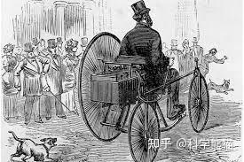

这款车诞生在1881年，足够早了吧。

Gustave Trouvé的电动车也是最早期的电动车之一，但是由于太过久远，是否确实是“世界上最早的电动车”还有待商榷，因为电动车的概念和早期原型在19世纪就已经出现。

他是一位法国电气工程师和发明家，在19世纪末对电动汽车的发展做出了贡献。Trouvé是一位多产的发明家，他在电动机、电池和其他电气设备方面有许多创新。

在1881年，Gustave Trouvé展示了一种小型的电动车辆，这可能是世界上第一辆电动汽车之一。这辆车是一种三轮车，它由可充电电池供电，并配备了Trouvé自己设计的直流电动机。这辆车的展示在当时的巴黎电气展览会上引起了轰动，展示了电动机动力传动的潜力。

Trouvé的工作是在电动汽车技术的早期阶段进行的，那时电动汽车还是一种新颖的概念。他的贡献对后来的发明家和工程师产生了影响，他们继续发展和改进电动车辆。然而，由于技术限制，特别是电池能量密度和成本的限制，电动汽车在20世纪初并没有成为主流，直到21世纪初电池技术的显著进步，电动汽车才开始获得更广泛的商业成功。

总的来说，Gustave Trouvé是电动汽车历史上的一个重要人物，他的实验性车辆展示了电动机的潜力，并为未来的电动汽车技术奠定了基础。

## 二、 (1832)在更早的年代，还有电动马车，你敢信吗？

在Trouvé之前，苏格兰发明家罗伯特·安德森（Robert Anderson）在1832年至1839年间制造了一种非充电式的电动马车。

此外，另一位苏格兰发明家，罗伯特·戴维森（Robert Davidson），也在1842年制造了一辆电动机车，并在苏格兰的铁路上进行了试验。这些都Trouvé的电动三轮车还更早。

然而，Gustave Trouvé在1881年制造的电动三轮车是一个重要的里程碑，因为它是第一辆小型的、电池供电的电动车辆，并且在公众面前进行了展示。Trouvé的电动三轮车是第一辆被广泛认知的电动车，并且他在电动车辆和便携式电动设备方面的工作对后来的发展产生了深远的影响。

因此，虽然Trouvé的电动三轮车不是世界上第一辆电动车，但它确实是电动车发展史上的一个关键进展，并且代表了电动车技术向实用化迈进的重要一步。

而Anderson的电动马车是一种非常初级的电动车，它使用的是非充电式的原始电池，也就是所谓的"原电池"。这种电池的能量储存有限，一旦耗尽就无法再使用，也无法通过充电来补充能量。

因此，尽管Robert Anderson的电动马车在历史上具有重要意义，但由于技术限制，它并未能实现商业化。由于太过久远，这款车我未能找到对应的图片资料。

## 三、(1842) 可以拉几十名乘客的电动车

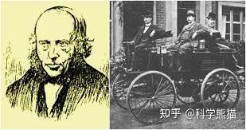

罗伯特·戴维森（Robert Davidson）是一位苏格兰发明家，他在19世纪中期对电动车辆的早期发展做出了重要贡献。

他在1842年制造了一辆名为“Galvani”的电动机车。这辆机车使用电池作为动力源，是世界上最早的电动机车之一。它在苏格兰的爱丁堡和格拉斯哥之间的铁路上进行了试运行。据报道，这辆机车能够以4英里每小时（约6.4公里每小时）的速度运行，并且能够拉动6吨的货物以及多达几十名乘客。

然而，戴维森的电动机车面临了一些挑战。当时的电池技术非常原始，电池不仅重而且效率低，这限制了机车的续航能力和实用性。此外，电动机车的概念在当时被认为是对蒸汽机车的威胁，这导致了一些抵制。据说，在一次展示中，戴维森的电动机车被一些感到威胁的铁路工人故意破坏。

尽管戴维森的尝试最终没有商业化，但他的工作展示了电动牵引的潜力，并为后来的发明家和工程师提供了灵感。他的实验性努力是电动车辆发展史上的一个重要步骤。

## 四、(1910) 100年前已经年产数千辆的电动车 —— Detroit Electric

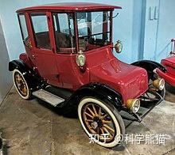

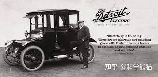

Detroit Electric是一个在20世纪初由Anderson Electric Car Company（后来改名为Detroit Electric Car Company）生产的电动车品牌。这个品牌的电动车在1907年至1939年间生产，是早期电动车技术的代表之一。

Detroit Electric的故事是电动车早期历史的一个重要篇章。在20世纪初，电动车与蒸汽动力和内燃机动力的车辆竞争。电动车因其安静、干净和易于操作的特点而受到特定市场的欢迎，尤其是在城市环境中。当时，电动车被认为是女性和医生的理想选择，因为它们不需要手动曲柄启动，这是当时的汽油车普遍需要的。

Detroit Electric的车辆以其可靠性和耐用性而闻名。它们通常配备有封闭的驾驶舱，提供舒适的乘坐环境，而且设计上也比较保守。这些车辆的电池续航能力在当时是相当不错的，一次充电可以行驶80到100英里（约128到160公里），这对于当时的技术来说是一个显著的成就。

Detroit Electric在1910年代达到了顶峰，每年生产数千辆车。然而，随着内燃机技术的进步，尤其是福特T型车的大规模生产，汽油动力车辆的价格大幅下降，这使得电动车在成本上变得不那么有竞争力。此外，汽油车的续航能力和加油便利性也在不断提高，这进一步削弱了电动车的市场地位。

尽管面临这些挑战，Detroit Electric继续生产电动车直到1939年，但随着时间的推移，产量逐渐减少。在其生产的最后几年，Detroit Electric主要是按订单生产车辆。

Detroit Electric的故事是电动车早期发展的一个缩影，展示了电动车在技术、市场接受度和与内燃机车辆的竞争中所面临的挑战。尽管最终被内燃机车辆所取代，但Detroit Electric和其他早期电动车制造商为电动车技术的发展奠定了基础。

## 五、(1899) 第一辆时速超过 100公里/小时 的电动车

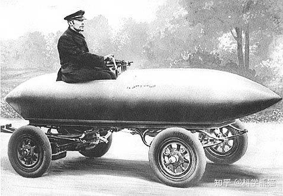

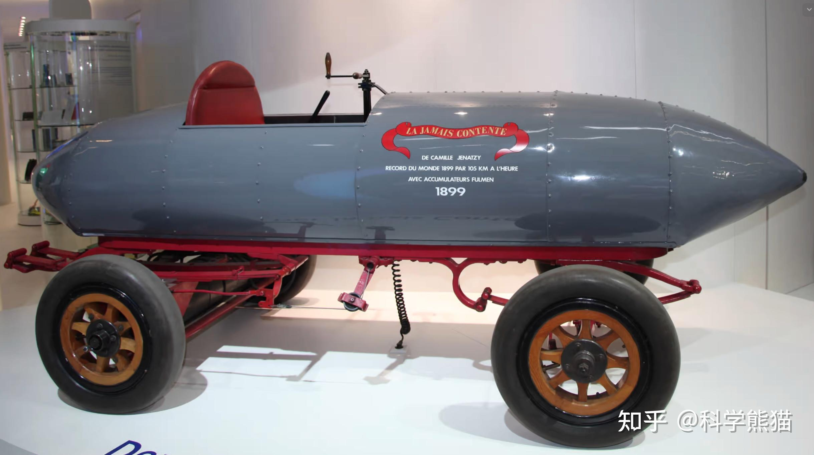

"Jamais Contente"（法语意为“永不满足”）是一辆非常著名的电动车，它在汽车史上占有一席之地，因为它是第一辆突破100公里/小时（约62英里/小时）速度的车辆。这辆车由比利时的汽车制造商Camille Jenatzy设计并驾驶，于1899年4月29日创造了这一历史性的速度记录。

"Jamais Contente"的设计非常独特，它的车身是子弹形的，这是为了最小化空气阻力。车身由铝制成，这在当时是一种非常先进的材料选择。这种流线型设计后来成为高速汽车设计的一个重要特征。

这辆车的动力系统同样具有创新性。它装备了两个直流电动机，这些电动机由一组镍-镉电池（Ni-Cd）提供动力。这种电池是由法国物理学家阿尔弗雷德·卢瓦尔（Alfred Louis Gave）发明的，它比当时常用的铅酸电池更轻，能量密度更高。"Jamais Contente"的电动机总共能够提供68马力（约50千瓦）的功率。

Camille Jenatzy不仅是一名勇敢的驾驶员，也是一名热情的发明家和工程师。他对速度的追求和对技术的热爱推动了他不断尝试和改进。在创造了速度记录之后，"Jamais Contente"和Jenatzy的名字都载入了历史。

"Jamais Contente"的成就不仅仅是一个速度记录，它还展示了电动车在速度和性能方面的潜力。尽管在20世纪初，内燃机车辆开始主导汽车市场，但"Jamais Contente"的成功预示了一个多世纪后电动车技术的复兴。今天，随着电动车在全球汽车市场中的地位日益增强，"Jamais Contente"被视为电动车发展史上的一个里程碑。

## 六、(1900) 轮毂电机的电动车，世界上最早的混合动力汽车，也是被中国网络水军为了某些目的，而编造成增程式的伟大电车 —— Lohner-Porsche

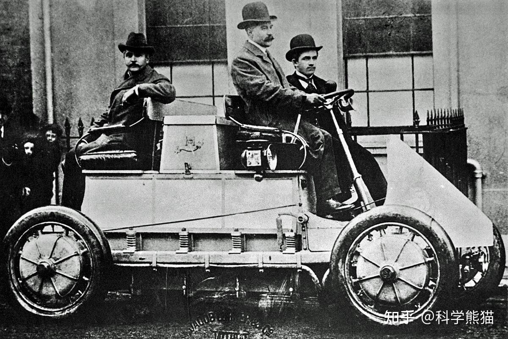

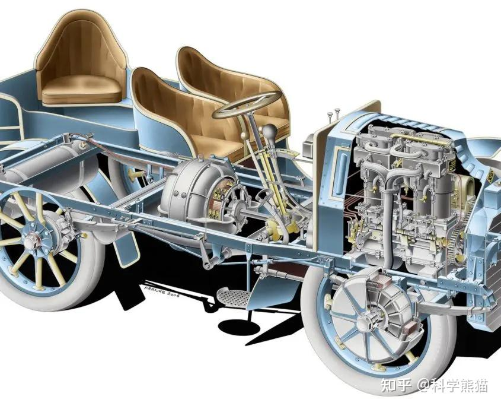

Lohner-Porsche是一款历史悠久的电动车，它的设计和制造归功于奥地利的汽车工程师费迪南德·保时捷（Ferdinand Porsche），他后来创立了著名的保时捷汽车公司。这款车在1900年的巴黎世界博览会上首次亮相，当时的名字是“Lohner-Porsche Elektromobil”。

费迪南德·保时捷当时是雅各布·洛纳公司（Jacob Lohner & Co.）的一名年轻工程师。雅各布·洛纳公司是一家位于维也纳的制造商，最初以生产豪华马车而闻名。随着汽车时代的到来，洛纳公司开始探索电动车的制造。

Lohner-Porsche电动车的最大创新之一是它的轮毂电动机——这是保时捷工程师的一个革命性设计。在这种设计中，电动机直接集成在车轮中，这样可以消除了复杂的传动系统，减少了能量损失，并提高了效率。这种设计被称为“电动车轮”，是世界上第一次将电动机直接集成到车轮中的尝试。

Lohner-Porsche的另一个版本是混合动力车，这款车名为“Semper Vivus”，它配备了一个内燃机和一个发电机，用于为电动车轮充电，这使得车辆可以在电池耗尽后继续行驶。这使得Semper Vivus成为世界上第一款功能性的混合动力车。

Lohner-Porsche电动车在当时是一款非常昂贵的车辆，主要面向富裕的客户。它在技术上取得了成功，但由于成本高昂，它并没有大规模生产。尽管如此，它在汽车历史上占有一席之地，因为它展示了电动车和混合动力车的早期潜力，并且预示了费迪南德·保时捷在汽车设计和工程方面的未来成就。

Lohner-Porsche电动车的设计理念和技术在今天的电动车和混合动力车中仍然有其影响，特别是在轮毂电动机的应用方面，这一概念在现代电动车技术中仍然被探索和发展。

## 七、 犹如恐龙的灭绝。1930 ~ 1970 这几十年间，早期的电动车突然消失了

电动车在19世纪末和20世纪初期明明已经取得了一些成功，但在1930年至1970年之间，电动车的发展确遇到了一些挑战：

1. 燃油技术进步：在这段时间里，内燃机技术取得了显著的进步，汽油车的性能、可靠性和续航里程都有了大幅度的提升。同时，由于大规模生产的效应，汽油车的价格也逐渐降低，使得更多的消费者能够负担得起。
2. 石油开采的爆发：在这段时间里，石油资源相对丰富，汽油价格较低，这使得汽油车在运行成本上具有优势。
3. 充电设施严重缺乏：当时的电力网络并不像今天这样发达，充电设施的缺乏使得电动车在使用上不如汽油车方便。
4. 电池技术未能突破：当时的电池技术从19世纪初开始往后的30年一直没有明显的进步，电池的能量密度低，重量大，充电时间长，限制了电动车的性能和便利性。导致在和燃油车的争锋中，失败了。

因此，尽管电动车在早期有过一段辉煌的历史，但在这段时间里，由于各种原因，电动车的发展被内燃机汽车所超越。直到70年代，随着电池技术有一定的升级，电动车第二次复活

## 八、70年代新生的漂亮电车 —— Bradley GTII

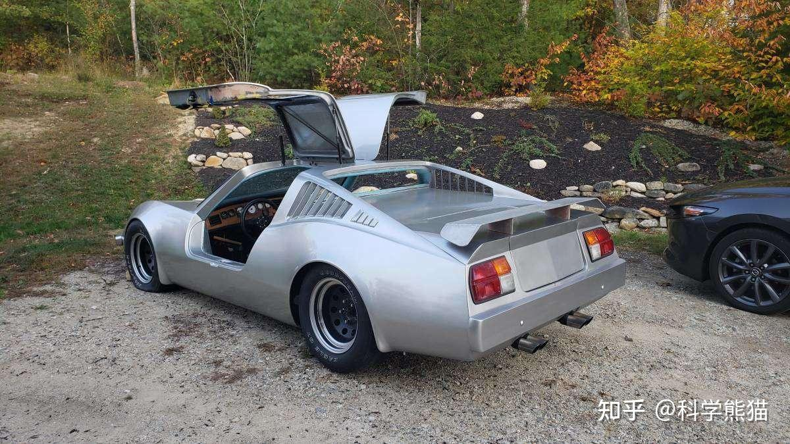

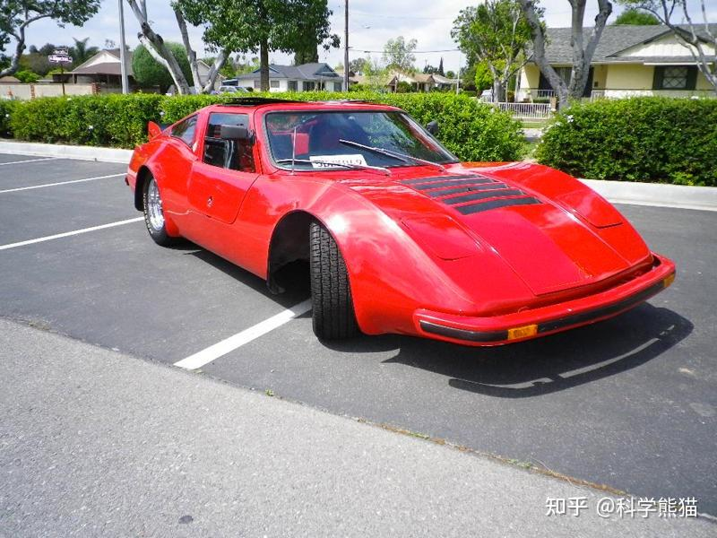

Bradley GTII是一款在1970年代后期到1980年代初期由Bradley Automotive生产的小型运动型电动车。这家公司总部位于美国明尼苏达州，以生产套件车（kit car）而闻名，这类车辆通常是由买家自己组装的。Bradley GTII是Bradley GT的后续型号，后者是一款基于大众甲壳虫底盘的套件车。

Bradley GTII的设计具有鲜明的70年代风格，拥有流线型的车身和独特的鸥翼门。它的车身是由玻璃纤维制成的，这使得车辆相对轻便，并且不易生锈。虽然大多数Bradley GTII是基于大众甲壳虫的后置后驱平台构建的，但也有一些是基于其他车辆的底盘，比如雪佛兰Vega。

关于Bradley GTII的电动版本，信息相对较少。Bradley Automotive主要生产燃油动力的车辆，但在电动车兴起的背景下，也有一些车辆被改装成电动车。这些改装通常是由第三方或车主自行完成的，他们将传统的内燃机替换为电动机和电池组。由于这些改装并非Bradley Automotive出厂时的标准配置，因此每辆电动的Bradley GTII可能都有不同的电动机、电池和续航里程。

Bradley GTII并没有成为主流的电动车，它更多是汽车爱好者和DIY者的选择。随着时间的推移，这款车成为了经典车和收藏家车辆的一部分，尤其是对于那些对70年代风格和套件车文化感兴趣的人来说。尽管Bradley GTII在电动车历史中并不占据重要位置，但它仍然是汽车多样性和个性化的一个有趣例证。

## 九、车长仅2.8米的可爱电动车里程碑车型：Enfield 8000

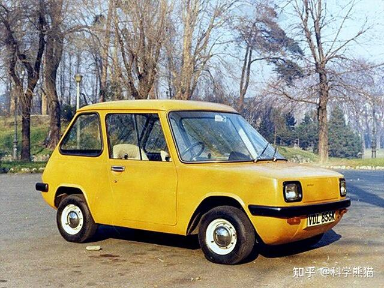

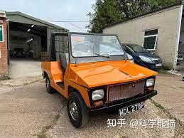

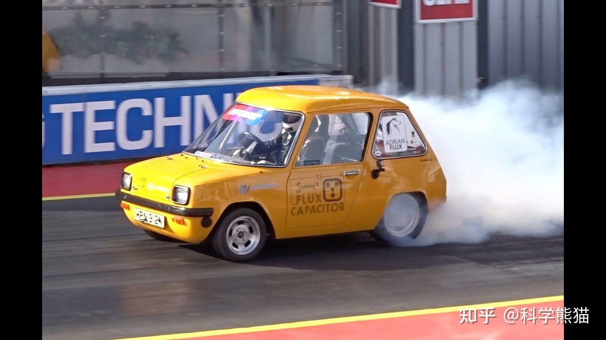

翻到Enfield 8000的照片，迷住我了，真漂亮

Enfield 8000是一款在1970年代初期生产的电动车，由英国的Enfield Automotive公司制造，这是一家位于伦敦的小型企业。这款车的设计目的是为了满足那个时代日益增长的对清洁、环保交通工具的需求。

Enfield 8000的外形小巧，仅有两座，是一款典型的城市通勤车。它的设计非常实用，车身较短，便于在繁忙的城市街道上驾驶和停车。车辆的长度大约只有2.8米（9英尺），宽度则约为1.3米（4英尺）。

这款车的动力系统由一组铅酸电池提供，这在当时是最常见的电动车电池类型。电池驱动一个相对较小的电动机，使得Enfield 8000的最高速度大约为48公里/小时（30英里/小时），续航里程在充满电的情况下大约为64公里（40英里）。虽然这些性能指标按照今天的标准来看相当有限，但在1970年代，这已经足以满足大多数城市通勤者的基本需求。

Enfield 8000的生产数量非常有限，据估计总共只生产了约120辆。这主要是因为它的成本相对较高，而且当时的市场对电动车的接受程度还不够。此外，由于1970年代的电池技术限制，它的性能和续航能力也无法与传统的内燃机车辆竞争。

尽管如此，Enfield 8000在电动车的发展史上仍然占有一席之地。它是早期电动车技术的一个实例，展示了在那个时代用于个人交通的电动车是什么样的。今天，随着电动车技术的飞速发展，Enfield 8000被视为电动车早期尝试的一个有趣的历史见证。对于汽车历史爱好者和电动车的早期探索者来说，它是一个值得研究和纪念的对象。

## 十、电动车逐渐成熟的标志性产品 —— Zagato Elcar

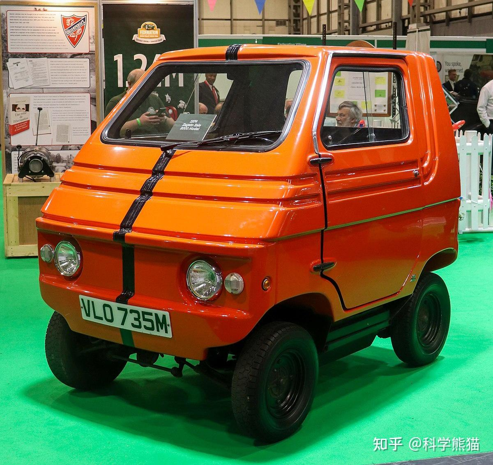

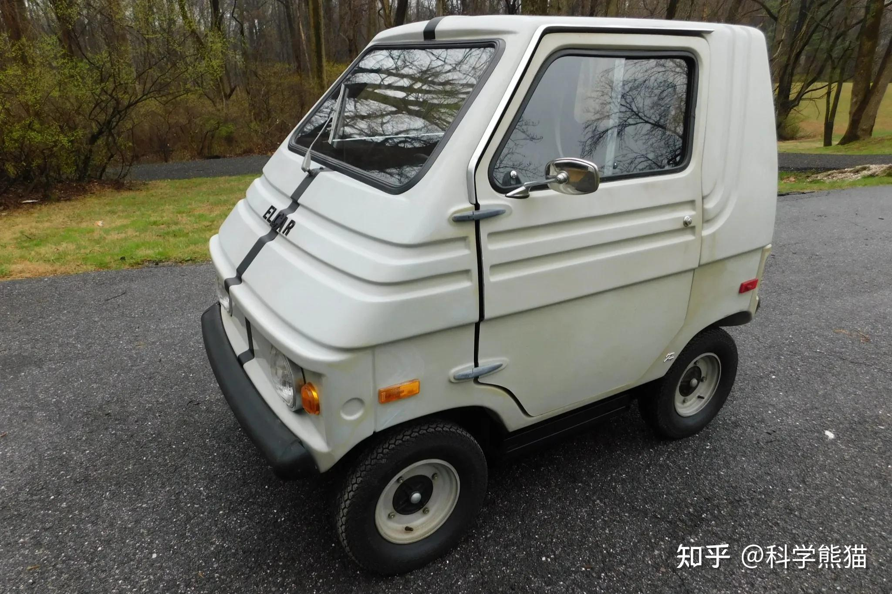

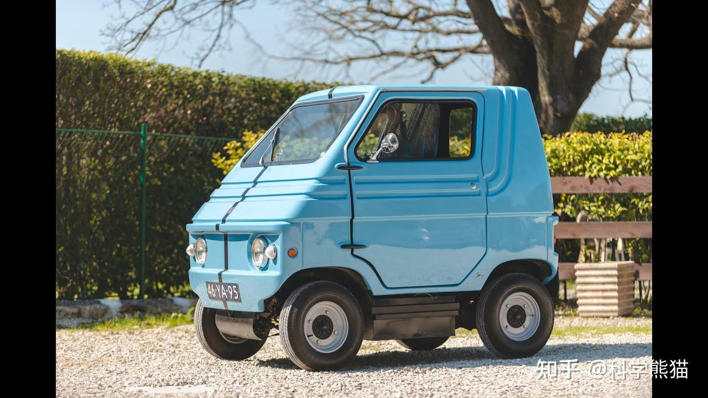

Zagato Elcar，也被称为Elcar Zagato，是一款在1970年代末到1980年代初由意大利公司Elcar（Electric Car）制造的电动车。Elcar公司与著名的意大利汽车设计公司Zagato合作，共同开发了这款车型。Zagato公司以其独特的设计和制造高性能赛车和豪华车而闻名，而Elcar Zagato则是他们在电动车领域的一次尝试。

Elcar Zagato是一款小型的城市电动车，设计用于短途出行和城市通勤。它的外观设计符合Zagato一贯的风格，拥有流线型的车身和独特的造型。这款车的尺寸较小，通常配备有两个座位，适合在拥挤的城市环境中灵活驾驶。

在技术规格方面，Elcar Zagato通常搭载铅酸电池，并配备一个小功率的电动机。这样的配置使得车辆的最高速度和续航里程都比较有限，但足以满足日常的城市行驶需求。由于是在电动车技术尚未成熟的年代生产，Elcar Zagato并没有大规模生产或广泛销售。

Elcar Zagato的生产数量相对较少，它更多地被视为电动车发展早期的一个实验性产品，而非大规模商业成功的例子。尽管如此，它仍然是电动车历史上的一个有趣篇章，代表了在20世纪70年代末至80年代初期电动车设计和制造的尝试。

随着时间的推移，这款车型成为了汽车收藏家和电动车历史爱好者感兴趣的对象，它见证了电动车从早期的尝试到今天成熟技术的演变过程。尽管Elcar Zagato可能不像一些现代电动车那样知名，但它在汽车设计史和电动车发展史中占有一席之地。

## 十一、 Sebring-Vanguard Citicar ： 电动车从边缘市场向主流市场转变的里程碑

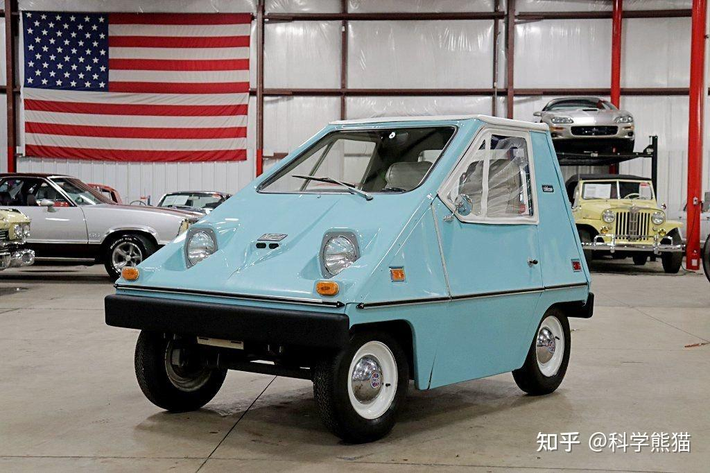

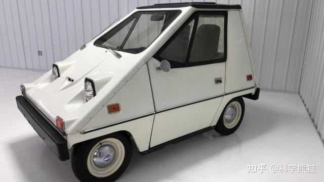

几十年前的电动车，也像极了21世纪初的深圳华强北的手机，真的是奇形怪状的，什么都有，哈哈。

Sebring-Vanguard Citicar 是一款在1974年在美国生产的电动汽车，它是当时美国市场上最著名的电动车之一。这款车由Sebring-Vanguard, Inc.公司制造，后来该公司被Comuta-Car和Comuta-Van所取代。Citicar的设计理念是简单、实用，主要针对城市居民的日常短途出行。

Citicar有几个显著的特点：

1. **外形设计**：Citicar的外观非常独特，几乎是一个楔形的箱型设计，非常紧凑。这种设计在减少风阻方面效果有限，但是在当时的电动车设计中，它的小巧尺寸和简单线条还是很吸引人的。
2. **尺寸和重量**：Citicar非常小巧，长度通常在2.5米（8英尺）左右，重量在590公斤（1300磅）左右，这使得它在城市中非常灵活，易于停车。
3. **动力系统**：Citicar配备了铅酸电池和直流电动机。最初的模型配备的电池容量较小，续航里程大约为40英里（64公里），而后来的模型通过增加电池容量将续航里程提高到约50英里（80公里）。车辆的最高速度大约在30到38英里/小时（48到61公里/小时）之间。
4. **生产和销售**：Citicar在1974年至1977年间生产，是当时美国历史上销量最高的电动车之一。尽管销量不错，但由于技术限制和市场因素，Citicar并没有长久地占据市场。
5. **市场影响**：Citicar的出现是在1970年代初期的石油危机背景下，这使得美国消费者开始考虑替代燃料汽车作为一种减少对石油依赖的方式。Citicar因其电动车身份而受到关注，尽管它的性能和舒适度与当时的传统汽车相比有较大差距。

Citicar代表了电动车早期的商业尝试，它的出现预示了未来电动车的潜力和可能性。虽然它的技术和性能与今天的电动车相比相差甚远，但Citicar在电动车发展史上仍然占有重要的地位，它是电动车从边缘市场向主流市场转变过程中的一个重要步骤。

## 十二、 电动车的第二次灭绝季（70年代末到90年代初）

20世纪70年代，电动车的兴起主要是由于几个关键因素的结合，包括1970年代初的石油危机，这导致了汽油价格的飙升和对替代能源汽车的兴趣增加。然而，进入80年代，电动车并没有流行起来，这主要是由于以下几个原因：

1. **石油价格下降**：70年代末到80年代初，石油价格开始下降，这减少了消费者对节能和替代能源汽车的兴趣。
2. **技术限制**：当时的电动车技术还不成熟，特别是电池技术。铅酸电池的能量密度低，充电时间长，续航里程短，这限制了电动车的吸引力。
3. **性能问题**：与内燃机汽车相比，电动车的性能和便利性还不能满足大多数消费者的需求。加速度、最高速度和续航里程通常都不如传统汽车。
4. **基础设施缺乏**：缺乏广泛分布的充电站意味着电动车主要用于短途行驶，这限制了它们的实用性和吸引力。
5. **政策支持减弱**：在70年代，政府对电动车的研发和推广提供了一定的支持，但到了80年代，这种支持减少了，部分原因是石油供应问题暂时缓解。
6. **消费者偏好**：消费者对电动车的兴趣减少，部分原因是因为他们对电动车的性能和便利性持怀疑态度。
7. **汽车制造商的犹豫**：汽车制造商对电动车的投资和推广持谨慎态度，因为市场需求不明确，而且电动车的利润率通常低于传统汽车。

因此，尽管70年代看到了电动车的一些发展，但上述因素共同作用导致了80年代电动车发展的停滞。这个时期，电动车的进步和普及受到了限制，而内燃机汽车继续主导市场。

然而，即使在这个时期，电动车技术的研究和开发并没有完全停止。一些制造商和研究机构继续探索改进电池技术、提高能效和降低成本的方法。这些努力为后来电动车技术的突破和90年代末至21世纪的复兴奠定了基础。

## 十三、 电动车第三次卷土从来（90年代末，21世纪初）

90年代末，随着全球对环境问题的关注增加，特别是对全球变暖和空气污染的担忧，电动车再次成为焦点。加州推出了零排放车辆（ZEV）法规，要求汽车制造商在其销售的车辆中包含一定比例的零排放车辆，这促使了一些制造商重新考虑电动车的开发。

此外，新世纪的到来伴随着锂离子电池技术的进步，这种电池比以前的铅酸电池和镍金属氢化物电池更轻、能量密度更高、充电速度更快，从而使电动车更加实用和吸引消费者。这些技术进步，加上政府的激励措施和消费者对可持续交通方式的日益增长的需求，共同推动了电动车市场的增长。

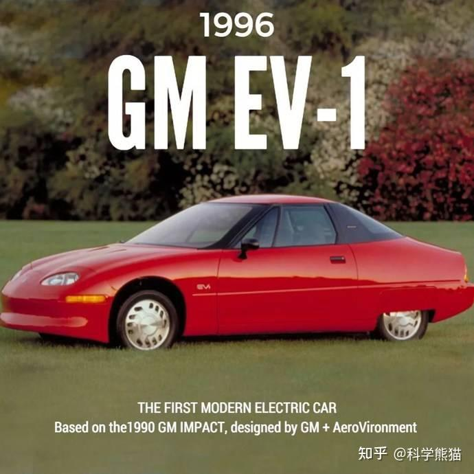

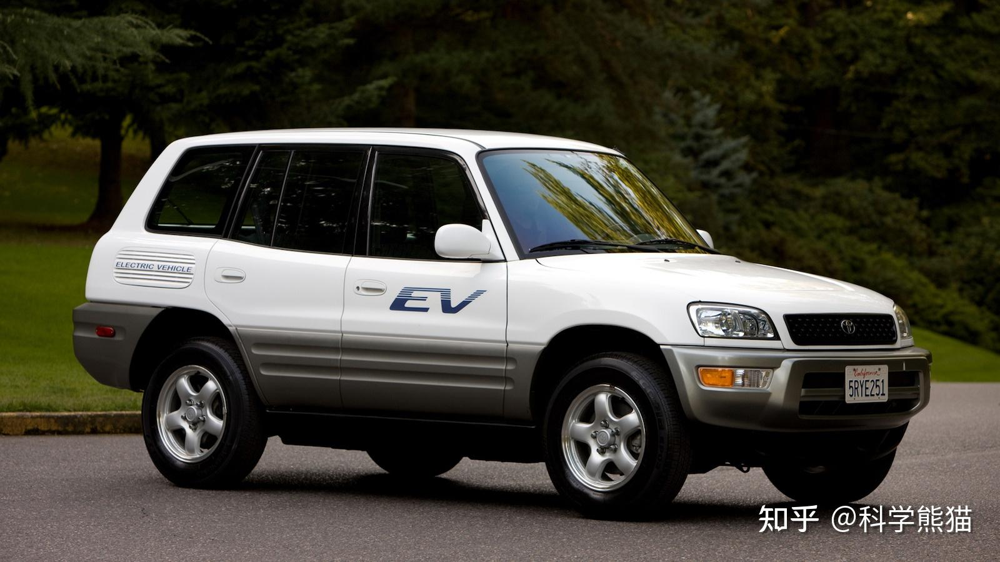

在20世纪90年代，电动车行业开始逐渐复苏，其中一些早期的电动车型号包括通用汽车（General Motors）的EV1和丰田（Toyota）的RAV4 EV。

**通用汽车的EV1** 是90年代最著名的电动车之一，也是第一款由主流汽车制造商生产的用于现代消费市场的电动车。EV1的特点如下：

1. **推出时间**：EV1于1996年开始租赁给消费者，主要在加利福尼亚州、亚利桑那州和乔治亚州的部分市场。
2. **设计**：EV1拥有一个流线型的外观设计，非常注重空气动力学效率，以减少风阻并提高续航里程。
3. **电池和续航**：最初的EV1使用铅酸电池，后来的版本升级为镍金属氢化物（NiMH）电池，提供了更好的续航里程。续航里程在70到100英里（约112到160公里）之间，这在当时是相当先进的。
4. **性能**：EV1的加速性能不错，可以在约8秒内从0加速到60英里/小时（约97公里/小时）。
5. **结束生产**：尽管EV1在技术上取得了一定的成功，但由于成本、市场和基础设施等多方面的挑战，通用汽车在2001年停止了EV1的生产，并回收了所有车辆。

**丰田的RAV4 EV** 是另一款在90年代末推出的电动车，它的特点包括：

1. **推出时间**：RAV4 EV最初在1997年作为租赁车辆推出，后来在2000年开始销售给公众。
2. **设计**：RAV4 EV基于丰田流行的RAV4紧凑型SUV设计，但配备了电动动力系统。
3. **电池和续航**：RAV4 EV使用镍金属氢化物电池，续航里程可达100英里（约160公里）以上。
4. **性能**：RAV4 EV提供了与其汽油版本相似的驾驶体验，但以零排放的方式运行。
5. **生产数量**：第一代RAV4 EV的生产数量相对较少，大约有1500辆车被制造出来。

这两款车型都是90年代电动车技术发展的重要标志，它们展示了电动车在续航里程、性能和实用性方面的潜力。虽然它们最终未能实现大规模商业化，但它们为21世纪电动车的崛起奠定了基础。

## 十四、 电动汽车再次辉煌的功臣：宝马 和 特斯拉

特斯拉第一次进入中国是在2014年，当年我就有幸驾驶了特斯拉。Model S 的3秒加速让我影响深刻，也是从此让我爱上了电动汽车。

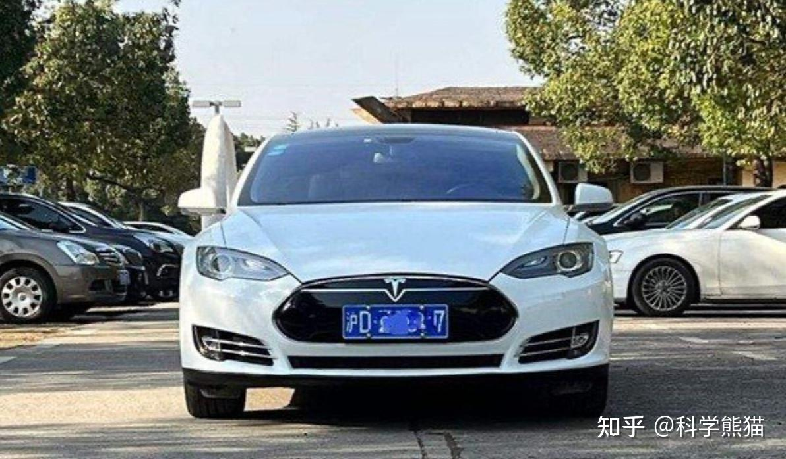

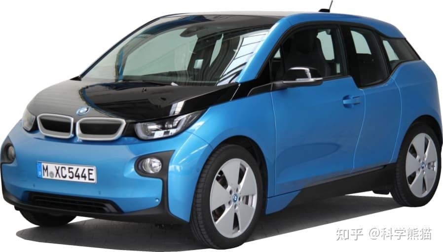

特斯拉（Tesla, Inc.）和宝马（BMW）是这一个时期电动车的引领者，但它们开始生产电动车的时间有所不同。

宝马在电动车领域的探索可以追溯到1972年，当时它为慕尼黑奥运会制造了一款名为BMW 1602e的电动车原型。然而，这只是一个展示项目，并未进入商业生产。宝马在随后的几十年里继续进行电动车的研发，但直到21世纪初，宝马才开始更加认真地投入电动车市场。2013年，宝马推出了i3，这是它的第一款量产电动车，标志着宝马在现代电动车市场的正式参与。

特斯拉成立于2003年，它从一开始就专注于电动车的开发和生产。特斯拉的第一款车型是Roadster，于2008年推出，这是一款基于莲花Elise底盘的高性能电动跑车。特斯拉Roadster的推出，对电动车市场产生了重大影响，证明了电动车不仅可以实现零排放，还能提供与传统跑车相媲美的性能。

## 十五、 历史上真正的第一台增程式汽车 —— Volt

增程式电动车（Range-Extended Electric Vehicle，REEV）是一种特殊的混合动力车型，它主要由电力驱动，但也配备了一个燃油发动机来为电池充电，从而增加行驶里程。

世界上最早的增程式电动车是由美国汽车制造商雪佛兰在2007年推出的Volt。Volt的主要特点是它主要依赖电力驱动，而燃油发动机主要用于为电池充电，而不是直接驱动车轮。这种设计使得Volt在大部分情况下都能像纯电动车一样运行，只有在电池电量不足时，燃油发动机才会启动。

Volt的这种设计使得它在城市驾驶中能够实现零排放，同时在长途驾驶中也能保证足够的行驶里程，因此被认为是一种理想的过渡技术，既能满足消费者对于行驶里程的需求，又能在一定程度上减少碳排放。

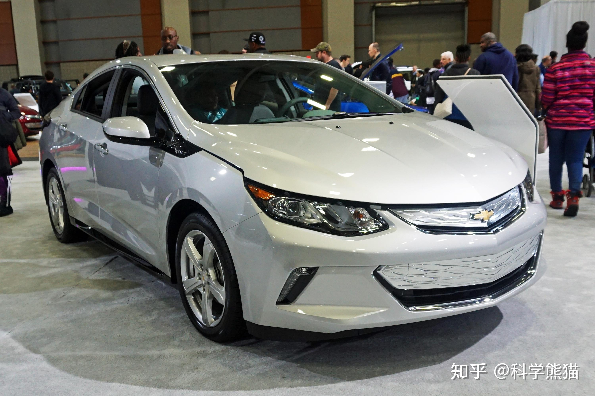

虽然雪佛兰Volt在技术上是一款创新的车型，但是它在市场上的表现并不如预期，有诸多原因：

**一是价格：**Volt的售价相对较高，这使得它在价格敏感的消费者中并不受欢迎。尽管政府提供了一些购车补贴，但这并不能完全抵消其高昂的价格。(2011年首次发布时，雪佛兰Volt的起始售价在美国约为$40,000美元。接近当时宝马X5在美国的价格，但是其加速性能只有9秒。舒适性配置也是比较少的，如果对比今天的国产增程车明星L9，Volt就是一个动力又弱又简陋的小车，但却卖到了X5的价格)

**二是技术复杂：**对，你没听错，技术复杂。并不是水军口中的增程式非常简单。这种技术确实是相对复杂的，因为需要同时维护电动机和燃油发动机，会增加维护成本，和制造难度，其综合复杂性是高于纯电车和纯油车的。

**三是时代限制：**当时充电设施不足，虽然Volt可以通过燃油发动机为电池充电，但如果要实现零排放，还需要依赖充电设施。然而，当时的充电设施并不完善，这也限制了Volt的发展。

**四是竞争关系：**Volt的推出时间正好与特斯拉的崛起相吻合。特斯拉的纯电动车在性能和品牌形象上都给消费者留下了深刻的印象，这使得Volt面临了很大的竞争压力。

**五是消费者认知：**许多消费者对增程式电动车的概念并不了解，他们可能更倾向于选择他们熟悉的燃油车或纯电动车。尽管Volt在技术上非常有创新性，但雪佛兰由于在运营推广能力上的欠缺，导致它并未在市场上取得预期的成功。

**长篇编辑，查阅资料，校对历史费了不少力气，权为了给中国网民有个完整正确的认知，不要叫别人笑话了。**

**点个关注呗。**
