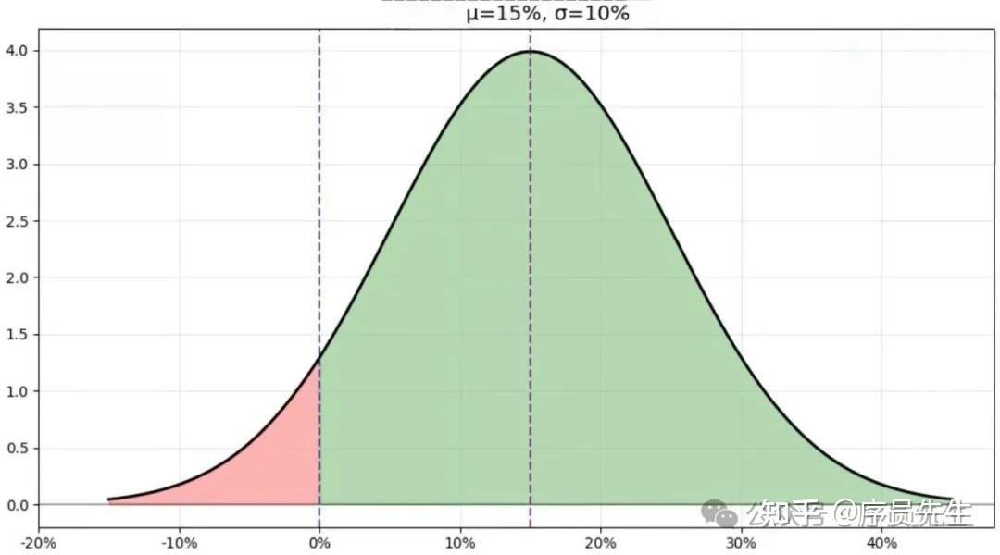
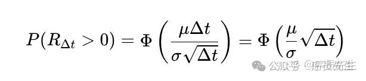
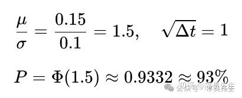
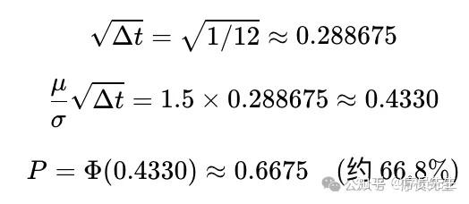
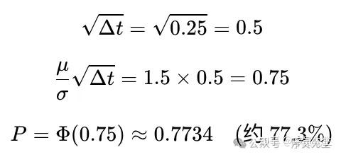
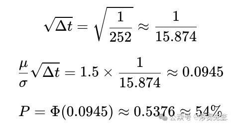
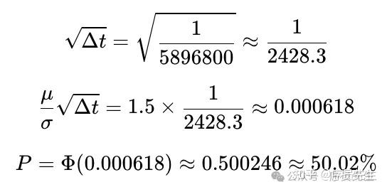
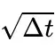
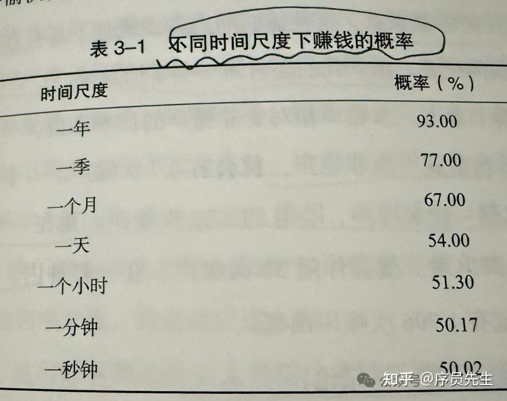

很多投资经验丰富，收益日趋稳定且丰厚的优秀投资者们，大都不约而同地支持一个观点 —— “**减少看盘的频率，能减少亏损的概率。**”

单看这个观点的字面含义，是没有逻辑性的。

<!--more-->


一些初入投资领域的朋友，尤其是智商较高擅长发现规律的朋友们，会敏锐的察觉到这一点：就是投资收益应该是和投资方法，技巧 甚至 运气关联，和看盘频率能有什么关系？这里找不到直接的因果关系，逻辑上无法直接成立。

然而，这里还真就有具体的数学证明。

“黑天鹅”理论之父，“反脆弱”思想实践者，著名投资学者、思想家 塔勒布 先生的《随机漫步的傻瓜》一书，对随机性的理解非常深刻。其中就举例了一个投资者投资和看盘频率的具体数学关系。

原文大意是：有一个牙医，他的投资收益率是15%每年，但是这个收益在真实世界中，因为随机性的作用，市场不是完全理性的，所以固定收益不可能存在，这个15%的收益率会有10%的上下波动，他的真实收益最大和最小处于 +25% ~ -5%之间。呈现正态分布。



书中原文到这里，就直接给出了数字的结论，证明每天都看盘，看到账户盈利的概率远远小于一年只看盘一次，发现盈利的概率。

可能是塔勒布先生考虑到大部分普通读者的数学基础有限，没有给出具体的证明公式。但是没有证明就直接拿出的结论，在我看到这里时，是意犹未尽的。

于是，我根据这个题目，做了数学推算，想验证塔勒布先生的说法是否为真：

### **【对公式不个感兴趣的朋友，可以跳到文章末尾，有最终结论的原理】**

###

### **模型假设**

- 投资收益率遵循**算术布朗运动**，即在任意时间区间内的收益率服从正态分布。
- 年化预期收益率 μ = 15% = 0.15，年化波动率 σ = 10% = 0.1。
- 对于长度为 Δt（以年为单位）的时间区间，该区间内的收益率 R_Δt 服从正态分布：
RΔt∼N(μΔt,σ2Δt)
即均值为 μΔt，标准差为 σ√Δt。

###

### **盈利概率公式**

在时间区间 Δt 内盈利（即收益率大于 0）的概率为：



其中 Φ 是标准正态分布的累积分布函数。

### 具体计算：

**年度查看时，看到账户盈利状态的概率**（Δt = 1 年）：



**按月度查看时**（Δt=1/12年）



**按季度查看时（Δt=0.25年）**



**每天都查看时**

假设一年有 252 个交易日，则 Δt = 1/252 年。



**每一秒都查看时**：

进一步假设每天交易 6.5 小时，一年 252 个交易日，则一年交易秒数为：

```
252×6.5×3600=5,896,800
```

因此 Δt = 1/5896800 年。



### 核心在于：观察频率越高（Δt 越小），盈利概率越接近 50%，因为



### 趋近于 0，使得 Φ 的参数趋近于 0，而 Φ(0) = 0.5。

最后贴上原书的计算结果，和本文的推算完全一致：



发现了吗？因为随机性波动的因素，这个牙医每年盈利概率高达93%的情况下，如果在一年内频繁查看，每一次查看的间隔越短，看到盈利的概率越低。相对应的，**如果查看股票账户越频繁，看到自己账户亏损的概率就越高。**

到这里还没完。

还有一个致命的人性影响，也是人脑的情绪波动存在非理性现象，这个现象和你是否是一个标榜理性的性格无关，是人人都无法逃脱的基本的大脑生理现象。

也就是：我们发现自己亏损时的紧张和悲伤等负面情绪的脑电波强度，明显高于我们发现自己盈利时喜悦带来的电波强度。经济学家估计，负面影响的强度，是正面影响强度的2.5倍以上。

这会导致什么？

如果这个牙医每一个小时都查看一次自己的账户，那么他有48.7%的概率，也就是接近一半的概率，会看见账户出现的亏损。而看见负面时的情绪影响又远大于正面时的影响。一天中查看如此多次，一周，一个月下来，看到的负面次数是非常多的。几乎没有人可以在这么频繁的负面情绪波动下，一直坚持让自己不做出错误的操作。最终都会崩溃而进行非理性操作。

在投资行为中，极度理性的看待自己的判断，这本身就是非常不理性的。人脑的运作是量子层面的脑电波模式，是无法用宏观世界的绝对规律预测的。这也是我们需要非常重视对随机性的理解的原因，同时也是大量高智商聪明人在股市中一败涂地的原因。足够聪明的人，在生活中发现和掌握规律的能力总是是超越旁人，这给他们建立了极大的自信，然而，随机性认知的盲点，可不管你有多聪明。
