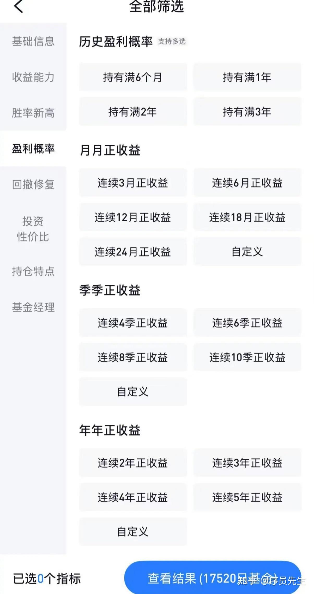

投资领域的随机性影响程度，远大于日常经验。

这给我们选择基金带来很大的思维误区。导致普通人在筛选基金时，习惯以基金上一年的收益率排序作为首要的筛选因子。同时，这也是银行等App内推荐基金吸引购买者的重要手段。这符合大家的常识，但却是一个错误的常识，让普通人始终无法选到好的基金。

<!--more-->

尤其是部分盲目追求规模与业绩的基金，会选择用一些激进的方法让自己能排到收益榜单里比较靠前的位置。一时的高收益背后是追热点，高杠杆，高风险等操作手法。也就是资深投资者经常讲的一句话：“结果对了，但原因错了”。这样的结果，舍弃为妙。

为了能正确理解选择基金的科学方法，讲一个有深度的事实：

这段信息里隐藏着一个关键知识，就是“投资的长期胜率原理 和  我们生活经验中常用的追求胜率法截然不同”。

我们生活中的常识是，一个奥运大满贯的冠军，必然在成功的路上多次夺取过冠军；一个高考能考上清北的高材生，必然在学习的路上，拿到过多次的班级第一名；一个累计销量最大的汽车品牌，一定是在历史上多年拿到过销量冠军的... ...

但是，巴菲特在有统计的漫长的 60 年投资生涯中，从未在任何单一年度成为全球“收益率第一”的投资者。我们的常规筛选法，大概率会把 “下一个巴菲特” 给排除掉。也意味着高概率命中 随机高收益之后时间里高概率的亏损。

我们身边永远不缺乏单一年度，投资收益 50%，100% 甚至更高的人。但是，一旦拉长时间，60 年的时间周期内，我们这颗星球来来回回出现过超过 100亿的人口，暂时无人超过巴菲特的记录。这揭示了投资领域的随机性影响程度，远大于日常经验。

关于这一点，在我的另外一篇文章有分享我的思考：

[股市波动的原因有哪些？投资者应如何制定有效的风险管理策略？](https://www.zhihu.com/question/661189157/answer/1965803903489664278?share_code=lGv9rvplr1GK&utm_psn=1965803982531330061)

下面是具体的方法。

该图是某基金 App 筛选基金的“条件筛选”界面：

可以看到，基金的总数很多，而筛选的各类组合条件更是眼花缭乱。

这里总结了五个优先级最高的筛选条件，这五个条件的优先级顺序是关键，务必留意！

一、 基金类型定位

货币基金【稳，但收益率过低】

债券基金【记住每当国债利率降低，债基就会走高】

股票基金【首推宽基指数基金 和 红利低波型基金】

股债混合基金【银行的固收+背后有这类的影子】

商品基金【适合小比例搭配】

QDII 基金【适当搭配，可实现全球资产平衡的效果】

选择哪几种投资？分别的比率如何搭配？是需要重点学习和了解的。

合理搭配可以降低综合风险，平滑收益曲线。

网络可检索出来的信息过多，初学者，可优先重点了解这几类基金的基本原理，以及对应的长期收益率 和 长期风险等级。

然后再结合自己的情况，优先分析风险是否在自己可接受的范围。

二、长周期（5 年以上）的历史最小回撤幅度

为什么是5 年？因为 5 年是常见的一个完整牛熊周期的长度。

穿越周期的回撤控制能力是评估基金风险管理和韧性（而非单纯收益）的最关键指标。

要注意：这里的历史是不预示未来的，回撤控制能力是为了揭示这支基金的风格和底线在哪里。

最优秀的基金是风险控制最好的基金。

芒格的口头禅就是“如果我知道自己会死在哪里，我就不会去那个地方”。

巴菲特的口头禅是 “复利奇迹的关键，不是求快，而是不要穷回去”。

三、基金经理选择

主动型基金的“灵魂”是基金经理。策略、风格、价值观的持续性高度依赖于首席负责人。

基金经理管理某基金如果持续超过5年，就能说明我们评估的历史表现主要是由当前这位经理创造的，未来延续的可能性更大。

重点关注这个基金经理是否会持续任职，如果出现基金经理变更，需要留意是否需要及时更换标的。好的基金管理平台是有基金经理任职信息变动展示的。

四、基金规模筛选

规模对不同类型的基金运作效率有不同的影响。

主动型基金（尤其投资中小盘股的）：

如果太大（百亿以上），灵活性受限，容易出现业绩拖累（阿尔法效应削弱）。

如果太小（小于1～2亿）， 运营成本摊薄效应差（净值中计提的管理费比例可能更大），同时也有清盘风险（规模持续低于5千万）。

10亿到50亿左右通常被认为是很多主动管理型基金（特别是灵活性要求高的）比较能发挥优势的区间。但需要具体分析，优秀的经理可能能管理更大规模。

如果是货币基金，被动型基金，上述规模边界的原理是明显不同的。这些知识在 AI 时代很容易获取，文本主要起提纲的作用，就不详细展开了。

五、 “夏普比率”

夏普比率是指单位风险所获得的超额收益，也可以理解为承受同等级风险值的情况下，性价比的数据，指标的值是越高越好。

该指标适合同一类型基金的横向对比（比如都是股票型），不同类型基金（如股票型和债券型）的夏普比率没有直接可比性。

这个指标属于锦上添花的筛选标准，可以在上面 4 个指标都筛选完毕后，当结果列表的基金数量依然较多时，可以把夏普比率从高到低排序选择。
